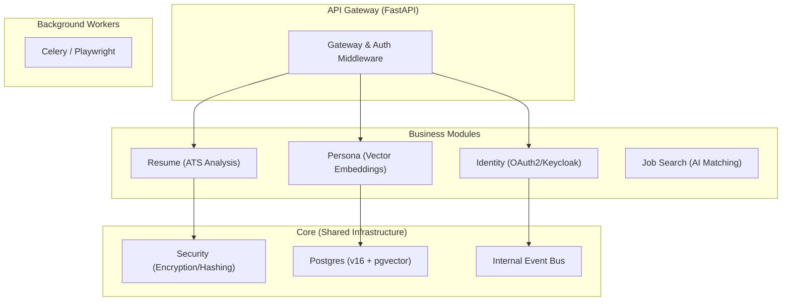

# 🌟 StellarApply.ai

**Proprietary Career Automation Platform**  
*The modern way to manage your career journey with AI-powered precision.*

---

## 🏗️ Architecture: Modular Monolith

StellarApply follows a **Modular Monolith** architecture, optimized for high developer velocity while maintaining microservice-like boundaries and scalability.

### Core Principles
- **Separation of Concerns**: Each business domain (Identity, Persona, Resume) resides in its own module.
- **Shared Kernel**: Common infrastructure (database, security, events) is centralized in `src/core`.
- **Domain Isolation**: Modules communicate via public APIs or the internal Event Bus, never by direct domain model access.



---

## 🚀 Quick Start

### 1. Prerequisites
- Docker & Docker Compose
- Python 3.12+
- [Poetry](https://python-poetry.org/docs/#installation) (Python Package Manager)

### 2. Environment Setup
Clone the repository and prepare the environment:
```bash
cp .env.example .env
# Edit .env with your local secrets (development defaults provided)
```

### 3. Spin up Infrastructure
Launch the managed services including PostgreSQL (pgvector), Keycloak, Redis, Meilisearch, and MinIO:
```bash
docker compose up -d
```

### 4. Application Installation
Install dependencies and run the development server:
```bash
poetry install
poetry run uvicorn src.api.main:app --reload
```

---

## 🛠️ Contribution Workflow

### 1. Create a Branch
Always create a new branch for your work:
```bash
git checkout -b feature/your-feature-name
```

### 2. Commit Standards
Follow [Conventional Commits](https://www.conventionalcommits.org/):
- `feat:` for new features
- `fix:` for bug fixes
- `docs:` for documentation changes
- `style:` for formatting (Ruff)
- `refactor:` for code changes that neither fix a bug nor add a feature

### 3. Pull Request Process
1. Push your branch and open a PR against `main`.
2. Ensure linting (`ruff`) and type-checking (`mypy`) pass locally.
3. PRs require CI validation and architect approval.

---

## 📦 Project Structure

```text
├── src/
│   ├── api/          # Entry point & Global Middleware
│   ├── core/         # Shared Infrastructure (DB, Security, Events)
│   ├── modules/      # Isolated Domain Modules
│   └── workers/      # Celery Background Tasks
├── docs/             # Technical Documentation
└── scripts/          # Automation & Setup Utility Scripts
```

---

## ⚖️ License
Proprietary. All rights reserved StellarApply.ai.
