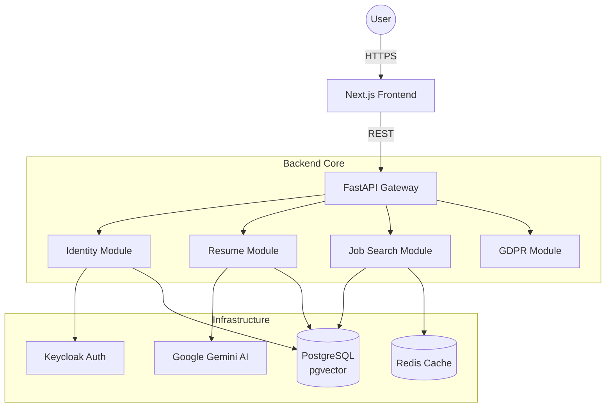

# 🏗️ System Architecture

## Architectural Pattern: Modular Monolith
StellarApply follows a **Modular Monolith** architecture. This balances the simplicity of a single deployment unit with the separation of concerns typically found in microservices.

### Why Modular Monolith?
- **Speed:** Code sharing is trivial; refactoring is safe.
- **Consistency:** Unified database transactions and shared domain models.
- **Scalability:** Modules can be extracted into microservices later if needed (e.g., the AI Job Search module).

## High-Level Components
1.  **Frontend (Presentation Layer):**
    - Built with **Next.js 16** (React 19, Server Components).
    - Styling: **TailwindCSS 4**.
    - State: **Zustand** (Local) + **TanStack Query** (Server).

2.  **API Gateway (API Layer):**
    - **FastAPI** application serving REST endpoints.
    - Handles Authentication (Keycloak Middleware) and Rate Limiting.

3.  **Domain Modules (Business Logic):**
    - Isolated modules with defined interfaces.
    - `src/modules/{module_name}`:
        - `identity`: User management & SSO.
        - `resume`: Resume parsing & generation.
        - `job_search`: Vector matching & job queries.
        - `persona`: Career profile management.
        - `gdpr`: Compliance data orchestration.

4.  **Infrastructure Layer:**
    - **Database:** PostgreSQL with `pgvector` for semantic search.
    - **Caching:** Redis for session & API response caching.
    - **AI Engine:** Google Gemini Client (`src/core/ai`).

## Diagram

